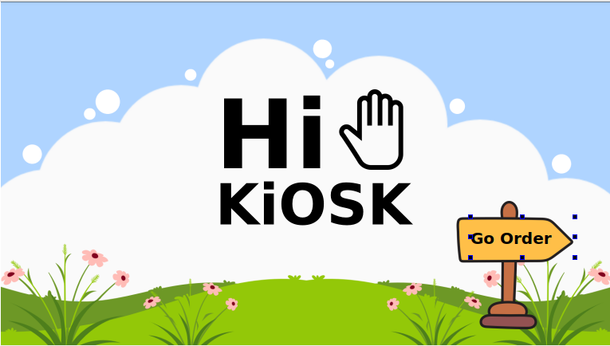
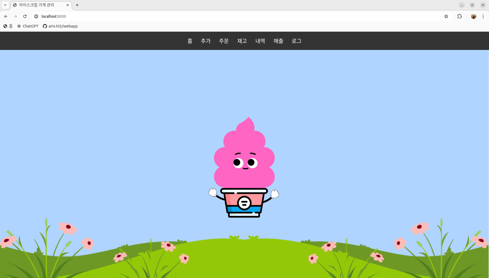

<div align="center">
  
  <br>
  <h1>🍦ROS2와 AI를 활용한 자율주행 로봇개발자 부트캠프</h1>
  <br>
  인공지능(AI) 서비스 로봇 기업 <b>엑스와이지(XYZ)</b>와 함께하는 프로젝트입니다.
  <br>
  <br>
  <b>📢하단의 이미지 클릭 시 소개 영상 페이지로 이동합니다.📢</b>
  <br>
  <br>
  <table>
    <tr>
      <td align="center">
        <b>엑스와이지 아리스(ARIS)</b>
        <br>
        <a href="https://www.youtube.com/watch?v=6-jCuQJ1Vt0">
          <br>
          
        </a>
      </td>
      <td align="center">
        <b>엑스와이지 스토리지(STORAGY)</b>
        <br>
        <a href="https://www.youtube.com/watch?v=-kP9PBeYSiY">
          <br>
          
        </a>
      </td>
    </tr>
  </table>
  <br>
  
  <h1>📃프로젝트 소개</h1>
  <br>
  <br>
  <b>로봇팔과 비전센서를 활용한 HRI</b><br>
  <b>돈두르마 퍼포먼스 무인 아이스크림 매장</b><br>
  <br>
  로봇공학, 인공지능, 컴퓨터 비전 등 다양한 기술을 통합한<br>
  인간과 로봇이 상호 작용하는 무인 아이스크림 매장의 로봇 서비스 및 시스템을 개발하였습니다.
  <br>
  <br>
  <h2>서비스 소개</h2>
  
  <table>
    <tr>
      <td align="center" width="33%">
        <h3>키오스크</h3>
        
      </td>
      <td align="center" width="33%">
        <h3>웹</h3>
        
      </td>
      <td align="center" width="33%">
        <h3>모바일</h3>
        
      </td>
    </tr>
  </table>

  <h3>ℹ️<a href="https://jangjh0201.notion.site/ROS2-AI-6e0de862f7164ba5b335b412cb71f36f?pvs=4"title="ROS2와 AI를 활용한 자율주행 로봇개발자 부트캠프">상세 페이지</a></h3>
  
  <br>
  <h2>아키텍쳐</h2>
  
  <br>
  
  <br>
  <h2>개발 기간</h2>
  2024.07.01 ~ 2024.07.26
  <br>
  
  <br>
  <h1>🙍팀원 소개</h1>
  <br>

  <table border="1" cellspacing="0" cellpadding="10">
    <tr>
      <th>이름</th>
      <th>업무</th>
      <th>이름</th>
      <th>업무</th>
    </tr>
    <tr>
      <td><strong>서원호<br>(팀장)</strong></td>
      <td>
        <ul>
          <li>무인 아이스크림 매장 프로세스 설계 및 제작</li>
          <li>ARIS 전체 모션 구현</li>
          <li>HRI 돈두르마 퍼포먼스 구현</li>
          <li>청소, 배송을 위한 장비 제작</li>
          <li>통합 시스템 ROS2로 구현</li>
        </ul>
      </td>
      <td><strong>이도현</strong></td>
      <td>
        <ul>
          <li>손 / 실링 / Aruco Marker 등 감지 구현</li>
          <li>카메라 & 로봇 좌표계 변환</li>
          <li>ARIS 모션 구현(청소, 아이스크림 받기) 보조</li>
          <li>KIOSK 포장/매장, 테이블 선택 UI 추가 제작</li>
          <li>STORAGY 객체 추종 파트 보조</li>
        </ul>        
      </td>
    </tr>
    <tr>
      <td><strong>전수익</strong></td>
      <td>
        <ul>
          <li>손 / 실링 / Aruco Marker 등 감지 구현</li>
          <li>ARIS 카메라 & 로봇 좌표계 변환</li>
          <li>ARIS 쓰레기 인지 모델 구현</li>
          <li>Vision 감지 파트 구현</li>
        </ul>
      </td>
      <td><strong>전민건</strong></td>
      <td>
        <ul>
          <li>ARIS 쓰레기 인지 모델 구현</li>
          <li>Vision 감지 파트 보조</li>
          <li>STORAGY 객체 추종 모델 구현</li>
          <li>카메라 & 로봇 좌표계 변환 파트 보조</li>
          <li>ROS2 통신을 이용한 Vision 모델 통합</li>
        </ul>        
      </td>
    </tr>
    <tr>
      <td><strong>김보선</strong></td>
      <td>
        <ul>
          <li>KIOSK GUI 제작</li>
          <li>통신 프로토콜 및 시스템 아키텍쳐 구성</li>
          <li>ARIS 기능 ROS2로 패키지화</li>
          <li>STORAGY Robot Controller 구현</li>
          <li>STORAGY Depth카메라/ LiDAR를 활용한 자세 보정 구현</li>
        </ul>
      </td>
      <td><strong>장준호</strong></td>
      <td>
        <ul>
          <li>DB 설계 및 백엔드 서버 구현</li>
          <li>웹앱 UI 설계 및 제작</li>
          <li>사용자/관리자 페이지 구현</li>
          <li>STORAGY 객체 추종 파트 데이터 전송 속도 개선</li>
          <li>ROS2 GUI to DB 파트 추가 구현</li>
        </ul>        
      </td>
    </tr>
  </table>
  
  <br>
  <h1>🔨패키지 설치</h1>
  <br>
  
  ```
  pip install -r requirements.txt
  ```

<div>
