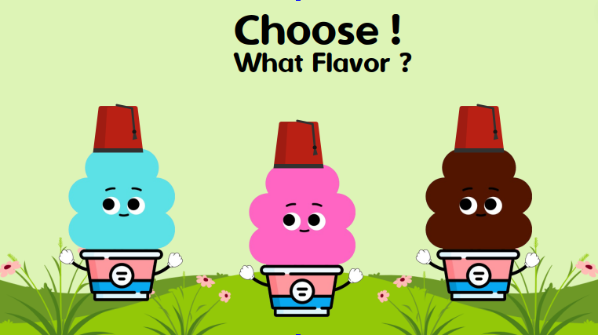
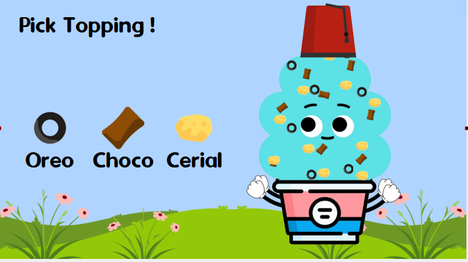
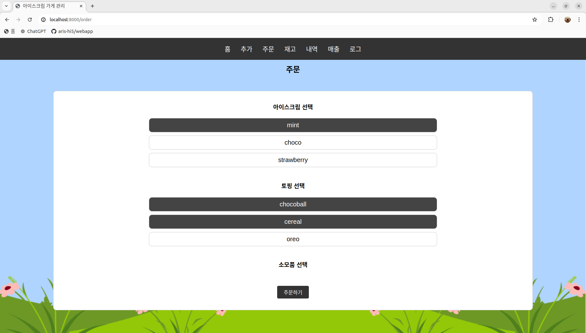
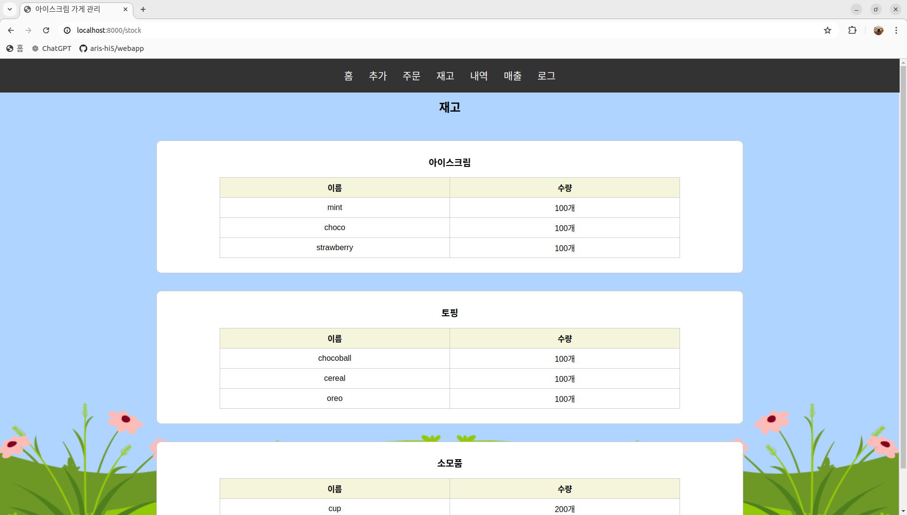
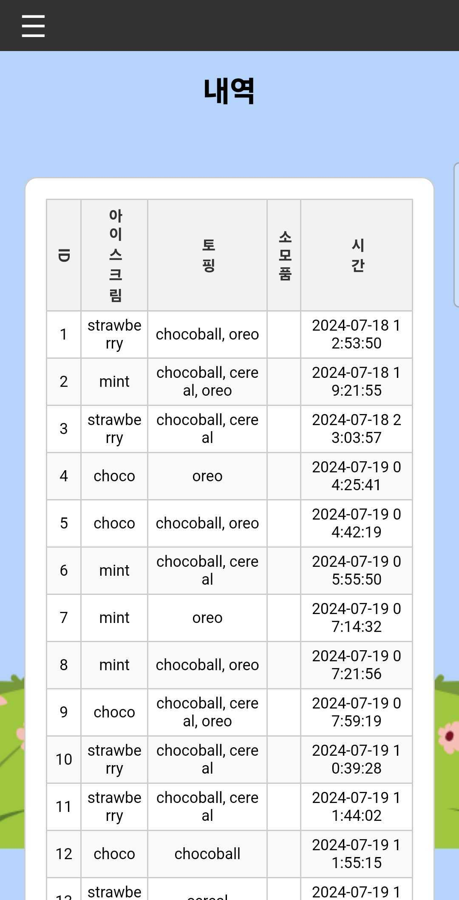
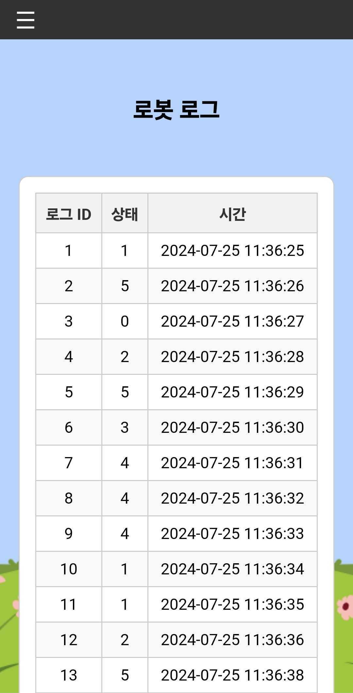
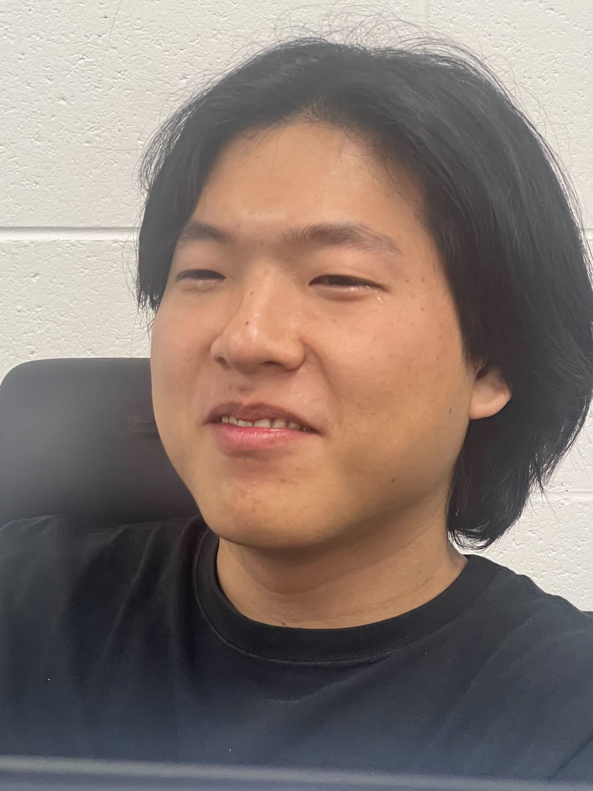

  
#  🍦ROS2와 AI를 활용한 자율주행 로봇개발자 프로젝트 1기 with XYZ 
인공지능(AI) 서비스 로봇 스타트업 XYZ와 함께하는 프로젝트입니다. 
라운지랩 무인 아이스크림 로봇 아리스(ARIS)의 개성있는 모션과 자동화된 프로세스로 사용자에게 즐거움을 선사합니다. 

**아리스** 
<https://youtu.be/QmEGj73KAvA>

#  📃프로젝트 소개

 
HI5 프로젝트입니다. 
기본적인 기능을 안전하고 확실하게 수행하는 아이스크림 기계 개발이 특징입니다. 
튀르키예(돈두르마) 컨텐츠를 구현하였습니다. 
딥러닝을 활용해 손 위치를 인식하여 N차 회피를 함으로써 사용자의 안전을 보장합니다. 

인간과 기계의 하이파이브를 위해 hi5는 오늘도 달려갑니다.👋  

### 💻키오스크

  
  
  

### 🖥️웹

  
  
  

### 📱모바일

  
  
  

#  🔍아키텍쳐

#  🕐개발 기간
2024.07.01 ~ 2024.07.26

#  🙍팀원 소개

|이름|역할|업무|
|---|---|---|
|서원호|팀장|업무|
|전수익|역할|업무|
|김보선|역할|업무|
|이도현|역할|업무|
|전민건|역할|업무|
|장준호|DB, Webapp|업무|

#  🔨패키지 설치
pip install -r requirements.txt

#  이도현

